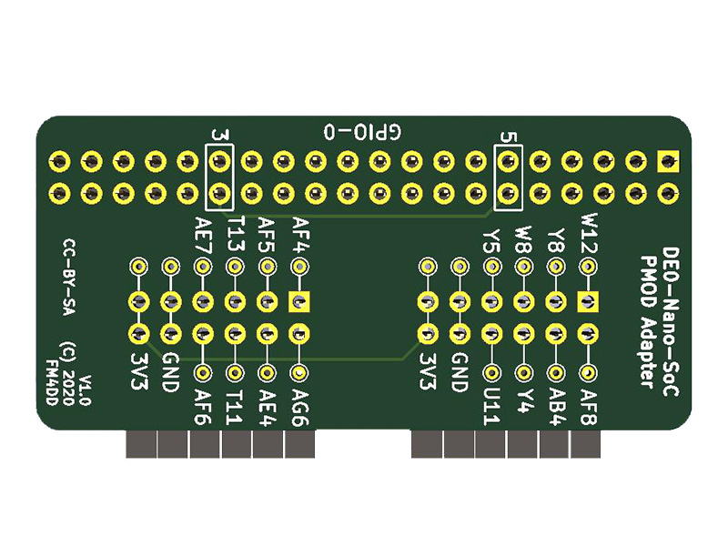
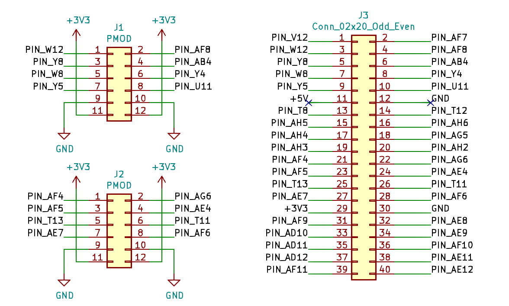
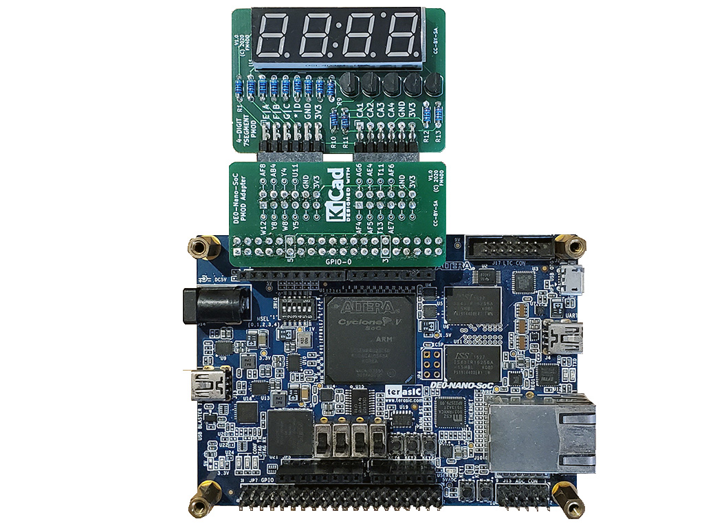

## PMOD2NANO

### Description

This module is a PMOD adapter for Intels DE0-Nano-SoC boards. DE0-Nano-SoC boards, equipped with Cyclone V FPGA, provide generic IO access through two proprietary 40-pin header rows with 36 IOs (72 IO total). The PMOD2NANO adapter converts 16 board IO's, together with the power lines, into two dual-row PMOD sockets. The adapter can be used on both GPIO rows for a total of four PMOD connectors.

http://fpga.fm4dd.com/

### Schematic

### PCB Gerber

[PMOD2NANO Gerber V1.0](20200112-pmod2nano-gerber-v10.zip)

### Pin Assignments

#### DE0-Nano-SoC

PMOD1|  Label | GPIO0A | GPIO1A | PMOD2|  Label | GPIO0B | GPIO1B
-----|--------|--------|--------|------|--------|--------|--------
1    |  IO1   | PIN_W12|PIN_AA15| 1    |  IO9   | PIN_AF4| PIN_AH23
2    |  IO2   | PIN_Y8 |PIN_AG26| 2    |  IO10  | PIN_AF5| PIN_AE19
3    |  IO3   | PIN_W8 |PIN_AF23| 3    |  IO11  | PIN_T13| PIN_AD19
4    |  IO4   | PIN_Y5 |PIN_AF21| 4    |  IO12  | PIN_AE7| PIN_AE24
7    |  IO5   | PIN_AF8|PIN_AH27| 7    |  IO13  | PIN_AG6| PIN_AG23
8    |  IO6   | PIN_AB4|PIN_AH24| 8    |  IO14  | PIN_AE4| PIN_AF18
9    |  IO7   | PIN_Y4 |PIN_AE22| 9    |  IO15  | PIN_T11| PIN_AE20
10   |  IO8   | PIN_U11|PIN_AG20| 10   |  IO16  | PIN_AF6| PIN_AD20

### Examples

7seg4 PMOD, connected through the PMOD2NANO adapter
